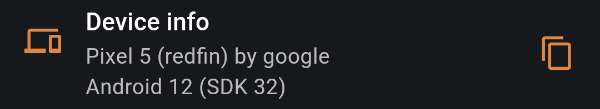

UI component which display information about the device.

## Dependencies

This package use [device_info_plus](https://pub.dev/packages/device_info_plus) package as a
device info source.

## Getting started

Add to your `pubspec.yaml`:

```yaml
dependencies:
  debug_bricks_device_info: <last_version>
```

## Usage




```dart
import 'package:debug_bricks_device_info/debug_bricks_device_info.dart';

class DebugScreen extends StatelessWidget {
  const DebugScreen({Key? key}) : super(key: key);

  @override
  Widget build(BuildContext context) {
    return DeviceInfoBrick(
      title: 'Device Info',
    );
  }
}
```

When a user clicks on UI displayed device info will be copied into the clipboard.

## Customization

You can customize output by pass custom `deviceInfoAdapter` instance in `DeviceInfoBrick` 
instantiation.

```dart
class CustomDeviceInfoAdapter extends DeviceInfoAdapter {
  const CustomDeviceInfoAdapter();

  @override
  String extract(BaseDeviceInfo deviceInfo) {
    //format data here
  }
}
```
