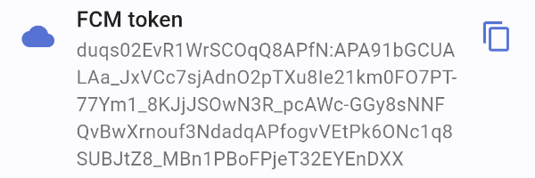
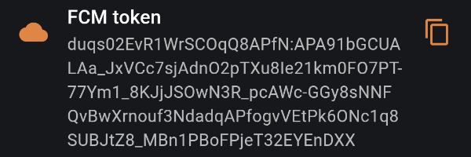

UI component which displays FCM token.

## Dependencies

This package use [firebase_messaging](https://pub.dev/packages) package. Before using brick 
make sure that your project setup firebase correctly.

## Getting started

Add to your `pubspec.yaml`:

```yaml
dependencies:
  debug_bricks_fcm_token: <last_version>
```

## Usage





```dart
import 'package:debug_bricks_fcm_token/debug_bricks_fcm_token.dart';

class DebugScreen extends StatelessWidget {
  const DebugScreen({Key? key}) : super(key: key);

  @override
  Widget build(BuildContext context) {
    return FcmTokenBrick(
      title: 'FCM token',
    );
  }
}
```