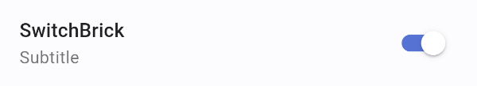
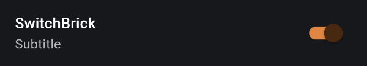
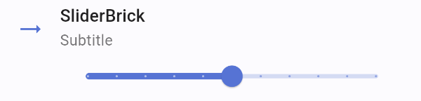
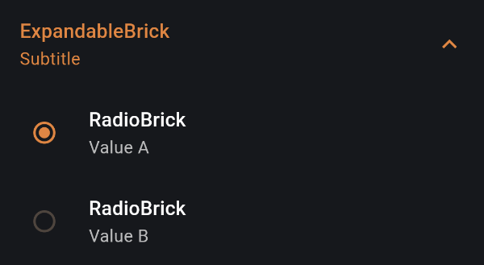

Set of UI components that you can use for implementing debug screens.

## Getting started

Add to your `pubspec.yaml`:

```yaml
dependencies:
  debug_bricks_ui: <last_version>
```

## Components

### TextBrick


```dart
import 'package:debug_bricks_ui/debug_bricks_ui.dart';

class DebugScreen extends StatelessWidget {
  const DebugScreen({Key? key}) : super(key: key);

  @override
  Widget build(BuildContext context) {
    return TextBrick(
      infoIconData: Icons.devices,
      actionIconData: Icons.copy,
      title: 'TextBrick',
      subtitle: 'Subtitle',
      onTap: () {},
    );
  }
}
```

### CheckboxBrick


```dart
import 'package:debug_bricks_ui/debug_bricks_ui.dart';

class DebugScreen extends StatelessWidget {
  const DebugScreen({Key? key}) : super(key: key);

  @override
  Widget build(BuildContext context) {
    return CheckboxBrick(
      title: 'CheckboxBrick',
      subtitle: 'Subtitle',
      value: true,
      changeListener: (value) => {},
    );
  }
}
```

### RadioBrick


```dart
import 'package:debug_bricks_ui/debug_bricks_ui.dart';

class DebugScreen extends StatelessWidget {
  const DebugScreen({Key? key}) : super(key: key);

  @override
  Widget build(BuildContext context) {
    return RadioBrick<String>(
      title: 'RadioBrick',
      subtitle: 'Subtitle',
      value: 'value',
      groupValue: 'value',
      changeListener: (value) {},
    );
  }
}
```

### SwitchBrick





```dart
import 'package:debug_bricks_ui/debug_bricks_ui.dart';

class DebugScreen extends StatelessWidget {
  const DebugScreen({Key? key}) : super(key: key);

  @override
  Widget build(BuildContext context) {
    return SwitchBrick(
      title: 'SwitchBrick',
      subtitle: 'Subtitle',
      value: true,
      changeListener: (value) => {},
    );
  }
}
```

### SliderBrick




```dart
import 'package:debug_bricks_ui/debug_bricks_ui.dart';

class DebugScreen extends StatelessWidget {
  const DebugScreen({Key? key}) : super(key: key);

  @override
  Widget build(BuildContext context) {
    final value = 50;
    return SliderBrick(
      title: 'SliderBrick',
      subtitle: 'Subtitle',
      iconData: Icons.trending_flat,
      minValue: 0,
      maxValue: 100,
      value: value,
      divisions: 10,
      label: value.toString(),
    );
  }
}
```

### ExpandableBrick




```dart
import 'package:debug_bricks_ui/debug_bricks_ui.dart';

class DebugScreen extends StatelessWidget {
  const DebugScreen({Key? key}) : super(key: key);

  @override
  Widget build(BuildContext context) {
    return ExpandableBrick(
      title: 'ExpandableBrick',
      subtitle: 'Subtitle',
      children: _buildChildren(),
    );
  }

  List<Widget> _buildChildren() {
    // build items
  }
}
```